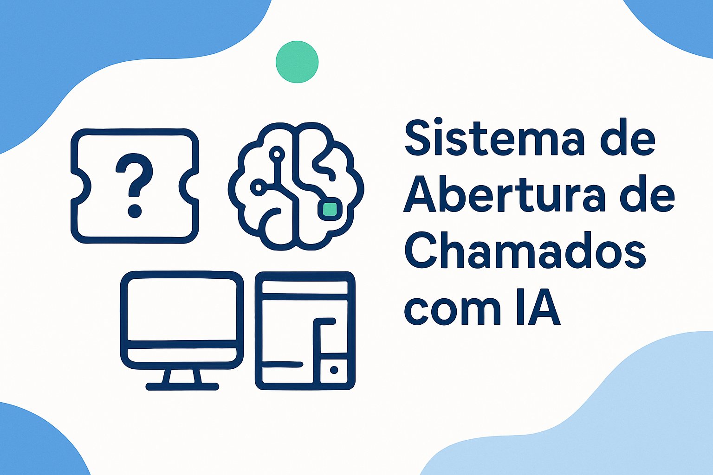

# Repositório Atividade Boas Práticas GitHub

  

## 🌟 Visão Geral do Projeto

O desafio consiste em desenvolver um **Sistema de Abertura de Chamados** nas plataformas **desktop, mobile e web**, integrado com **Inteligência Artificial gratuita**. O sistema deve permitir que os usuários abram, acompanhem e encerrem chamados de forma simples, além de oferecer suporte automatizado através de IA.

Esse projeto busca **otimizar o atendimento interno** de empresas, **reduzir tempo de resposta** e **centralizar a comunicação** entre equipe e cliente.

---

## 🔗 Repositórios de Documentação

| Seção | Descrição | Status | Link |
| :--- | :--- | :--- | :--- |
| **📋 Backlog do Produto** | Detalhamento das funcionalidades e requisitos do sistema. | Em Andamento | [Acessar Backlog](https://github.com/Nicolasdev29/Backlog_do_produto) |
| **🚀 Evolução do Projeto** | Acompanhamento do progresso e das mudanças ao longo das iterações. | Em Andamento | [Acessar Evolução](https://github.com/Nicolasdev29/Evolucao_do_projeto) |
| **📆 Tabela das Sprints** | Cronograma e planejamento das atividades por sprint. | Em Andamento | [Acessar Tabela](https://github.com/Nicolasdev29/Tabela_das_sprints) |
| **💻 Tecnologias Utilizadas** | Lista de todas as ferramentas e frameworks empregados no projeto. | Completo | [Acessar Tecnologias](https://github.com/Nicolasdev29/Tecnologias_utilizadas) |
| **🏗️ Estrutura do Projeto** | Organização dos diretórios e módulos do código-fonte. | Completo | [Acessar Estrutura](https://github.com/Nicolasdev29/Estrutura_do_projeto) |
| **👥 Equipe** | Informações sobre os membros da equipe de desenvolvimento. | Completo | [Acessar Equipe](https://github.com/Nicolasdev29/Equipe) |

---

## 💡 Status do Projeto

Este projeto está em **Desenvolvimento Ativo**.

  

---

## 🛠️ Tecnologias

Para uma lista detalhada, acesse o repositório [Tecnologias Utilizadas](https://github.com/Nicolasdev29/Tecnologias_utilizadas).

## 🤝 Contribuição

Para contribuir com este projeto, por favor, siga as diretrizes no repositório [Estrutura do Projeto](https://github.com/Nicolasdev29/Estrutura_do_projeto).

## 📝 Licença

(Adicionar informações de licença aqui, se houver)

---

*Este README foi aprimorado para melhor visualização e organização.*
